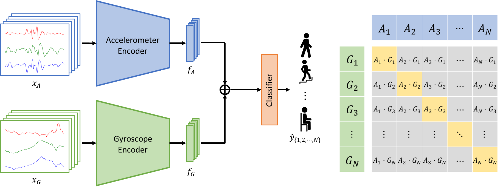

# CAGE

**Contrastive Accelerometer-Gyroscope Embedding Model for Human Activity Recognition**

Inyong Koo, Yeonju Park, Minki Jeong, Changick Kim



This repository provides a pytorch implementation for the paper "Contrastive Accelerometer-Gyroscope Embedding Model for Human Activity Recognition (IEEE Sensors Journal, 2022)".

## Data Preparation

1. Download datasets ([UCI-HAR](https://archive.ics.uci.edu/ml/datasets/human+activity+recognition+using+smartphones), [mHealth](http://archive.ics.uci.edu/ml/datasets/mhealth+dataset), [MobiAct](https://bmi.hmu.gr/the-mobifall-and-mobiact-datasets-2/), [PAMAP2](https://archive.ics.uci.edu/ml/datasets/PAMAP2+Physical+Activity+Monitoring)) in `data/`

    `data` \
    `├── UCI HAR Dataset`\
    `├── MHEALTHDATASET`\
    `├── PAMAP2_Dataset`\
    `└── MobiAct_Dataset_v2.0`


- Although not introduced in paper, we also support [Opportunity](https://archive.ics.uci.edu/ml/datasets/opportunity+activity+recognition) and [USC-HAD](https://archive.ics.uci.edu/ml/datasets/opportunity+activity+recognition) datasets in our framework. 


1. Create processed data splits for all datasets with 

```
python create_dataset.py
```


## Training

To train Contrastive Accelerometer-Gyroscope Embedding (CAGE) model, run

```
python train_CAGE.py --dataset {Dataset}
```

We also provide baseline models such as DeepConvLSTM (Ordóñez *et al.*, 2016), LSTM-CNN (Xia *et al.*, 2020), and ConvAE (Haresamudram *et al.*, 2019).

```
python train_baseline.py --dataset {Dataset} --model {Model}
```


